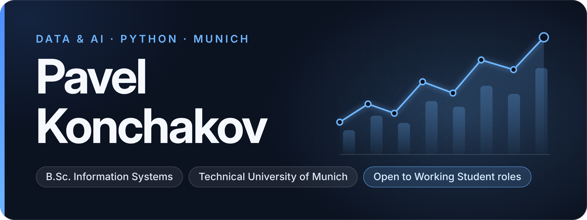

 

I study **Information Systems (B.Sc. Wirtschaftsinformatik) at TUM** and live in Munich. Most of what I build is in **Python** and sits somewhere between data and AI: text analysis, data pipelines, bots that automate routine work. Before TUM I completed the TUDIAS Studienkolleg (W-Kurs, final grade 1.6, German C1).

I am looking for a **Working Student or internship position in Munich**.

 

## Featured projects

Collects bank customer reviews from two sites, scores sentiment with a locally hosted LLM and groups the reviews into ten topics with TF-IDF and KMeans, exported as an HTML report with word clouds. 
**Role** team of four · **Stack** Python, pandas, scikit-learn, NLTK, Selenium, BeautifulSoup · [Repository](https://github.com/ArPicasso/Sirius_AI_2024)

 

Prototype of a medical predictive service: a patient describes complaints in free text and gets routed to the right specialist. The repository holds the data study of 12,765 visit records and the feature engineering on the complaints column. 
**Role** team captain · **Stack** Python, pandas, NumPy, pymorphy2, Jupyter · [Repository](https://github.com/ArPicasso/Sirius_AI_2023)

 

Telegram Mini App and reminder bot for a Russian U21 hockey league: schedule, results, standings and player stats. League data is rebuilt every hour by GitHub Actions and served as a static app from GitHub Pages. 
**Role** product and architecture decisions, built with Claude Code as coding agent · **Stack** Python, aiogram 3, vanilla JS, GitHub Actions · [Repository](https://github.com/ArPicasso/bogdanov) · [Live app](https://arpicasso.github.io/bogdanov/)

 

Information website for an environmental campaign on tyre recycling, a volunteering project from 2024. 
**Role** built the site · **Stack** Tilda · [bezpokrishek.tilda.ws](https://bezpokrishek.tilda.ws)

 

## Tech stack

**Data & AI** &nbsp; Python · pandas · NumPy · scikit-learn · NLTK · Jupyter 
**Backend & automation** &nbsp; FastAPI · aiogram · Playwright · Selenium · GitHub Actions 
**Web** &nbsp; TypeScript · Next.js · Tailwind CSS 
**Learning now** &nbsp; Java · Go

## Contact

[LinkedIn: pavel-konchakov](https://www.linkedin.com/in/pavel-konchakov)
